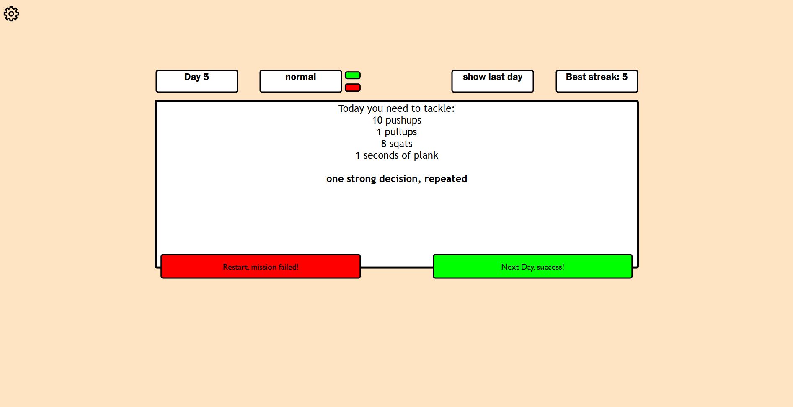

# workout-challenge

This is my first GitHub project. A small but functional workout challenge app. The core features work, though the settings and colour theme picker are still in progress. Super proud to share this as my first public project here on GitHub!

What i learned:
- forEach and querySelector
- using setIntervals 
- first used localStorage
