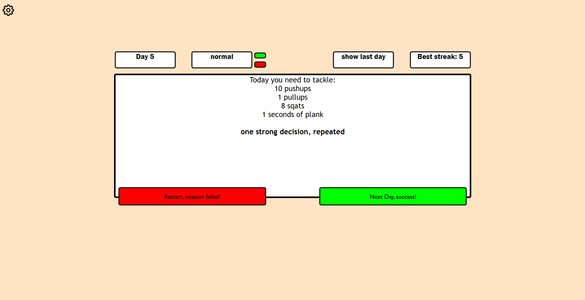

# workout-challenge

This is my first GitHub project! a small but functional workout challenge app. The core features work just as they should (most of the time), though the app’s still a bit of a work in progress. Super proud to finally share this as my first public project here on GitHub!

I’m still pretty new to programming, so if you peek at my code and feel the sudden urge to facepalm, please go easy on me. 😅 If you spot any questionable code crimes, do let me know — I promise I’ll serve my sentence and fix them.

What I learned building this:

- forEach and querySelector
- Using setInterval
- First time using localStorage
- The deep emotional pain of one missing semicolon

# How to run

Since I’m using ES modules, you can’t just double-click index.html and run it — that’ll throw MIME-type tantrums and ruin your day. You’ll need to run it through a local server instead.

1. Install the Live Server extension in VS Code (by Ritwick Dey).
2. Open this project folder in VS Code.
3. Right-click index.html then select "Open with Live Server".
4. It should launch automatically in your browser ( something like http://127.0.0.1:5500/).

# Build with
- HTML5
- CSS3
- JavaScript (ES6)
- Web Storage API (LocalStorage)
That’s it! Have fun 

